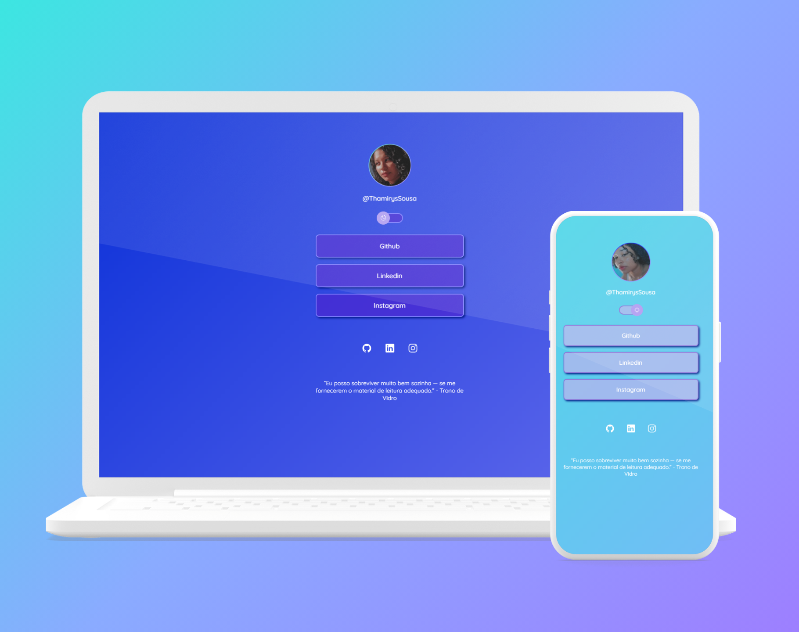

<h1 align="center"> MyLinks </h1>

Feito com o auxilio do programa de ensino da Rockeseat.  

 

 

 Tecnologias:
  
 Esse projeto foi desenvolvido com as seguintes tecnologias:

    HTML e CSS / JavaScript / Git e Github / Figma

 Projeto:
  
 O MyLinks é um agregador de links para usar como cartão de visitas online.